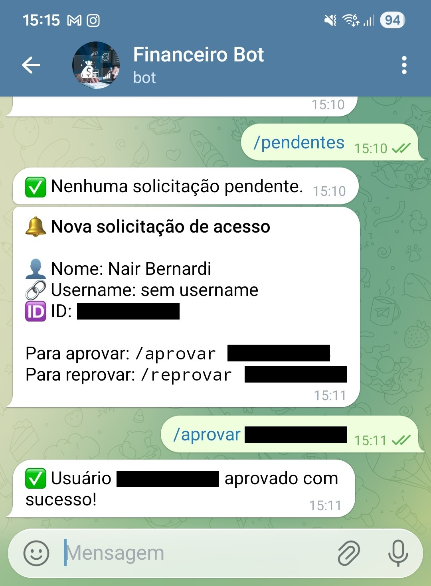
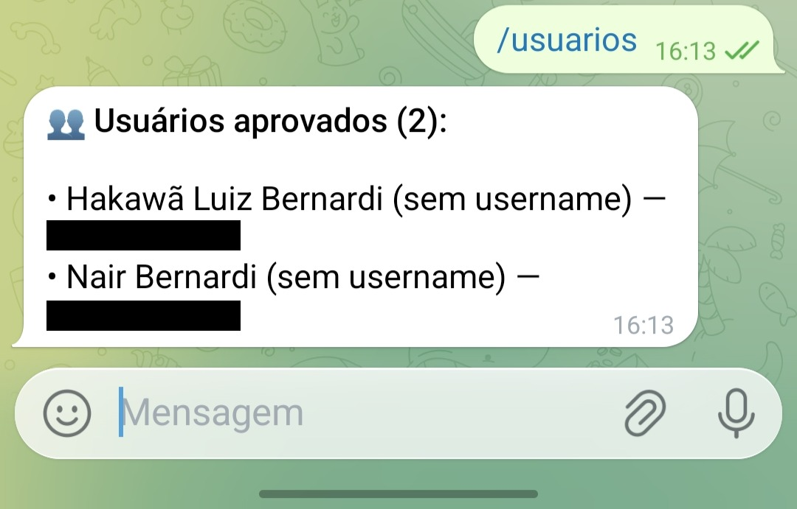

# 💰 Telegram Finance Bot

Bot de controle financeiro pessoal para Telegram. Registre gastos e receitas, visualize resumos mensais e exporte planilhas Excel — tudo pelo chat, com dados separados por usuário e sistema de aprovação de acesso.

---

## ✨ Funcionalidades

- 💸 Registrar gastos e receitas por categoria
- 📊 Resumo financeiro mensal com saldo e detalhamento por categoria
- 📥 Exportação de planilha Excel (.xlsx) formatada
- ✏️ Editar lançamentos já registrados
- 🗑️ Deletar lançamentos por ID
- 👥 Dados completamente separados por usuário
- 🔐 Sistema de aprovação — você controla quem pode usar o bot
- 🗃️ Armazenamento em SQLite com queries parametrizadas

---

## 🤖 Comandos

### Usuários
| Comando | Descrição | Exemplo |
|---|---|---|
| `/start` | Solicita acesso ao bot | `/start` |
| `/help` | Lista os comandos disponíveis | `/help` |
| `/gasto <valor> <categoria>` | Registra um gasto | `/gasto 59.90 mercado` |
| `/receita <valor> <categoria>` | Registra uma receita | `/receita 3000 salario` |
| `/resumo [MM/AAAA]` | Resumo do mês | `/resumo` ou `/resumo 05/2025` |
| `/planilha [MM/AAAA]` | Gera e envia planilha Excel | `/planilha` |
| `/deletar` | Lista lançamentos para deletar | `/deletar` |
| `/deletar <id>` | Deleta um lançamento | `/deletar 3` |
| `/editar` | Lista lançamentos para editar | `/editar` |
| `/editar <id> <campo> <valor>` | Edita um lançamento | `/editar 3 valor 49.90` |

### Admin
| Comando | Descrição |
|---|---|
| `/pendentes` | Lista usuários aguardando aprovação |
| `/aprovar <user_id>` | Aprova um usuário |
| `/reprovar <user_id>` | Remove o acesso de um usuário |
| `/usuarios` | Lista todos os usuários aprovados |

---

## 🔐 Como funciona o acesso

Nenhum ID precisa ser configurado manualmente. O fluxo é simples:

```
1. Usuário envia /start
2. Bot notifica o admin com os dados e o comando de aprovação
3. Admin envia /aprovar <user_id>
4. Usuário recebe confirmação e já pode usar o bot
```

---

## 📁 Estrutura do projeto

```
telegram-finance-bot/
├── main.py                  # Inicialização e registro de handlers
├── requirements.txt
├── .env.example             # Modelo de configuração
│
├── handlers/
│   ├── _security.py         # Controle de acesso e sanitização de inputs
│   ├── start.py             # /start — cadastro e solicitação de acesso
│   ├── admin.py             # /aprovar /reprovar /pendentes /usuarios
│   ├── gastos.py            # /gasto
│   ├── receitas.py          # /receita
│   ├── resumo.py            # /resumo
│   ├── planilha.py          # /planilha
│   ├── deletar.py           # /deletar
│   ├── editar.py            # /editar
│   └── help.py              # /help
│
└── services/
    ├── storage.py           # Persistência SQLite por usuário
    └── report.py            # Relatórios e exportação Excel
```

---

## 🚀 Instalação

### Pré-requisitos
- Python 3.10 ou superior
- Conta no Telegram
- Um bot criado via [@BotFather](https://t.me/BotFather)

### 1. Clone o repositório

```bash
git clone https://github.com/seu-usuario/telegram-finance-bot.git
cd telegram-finance-bot
```

### 2. Crie e ative o ambiente virtual

```bash
# Linux/macOS
python3 -m venv venv
source venv/bin/activate

# Windows
python -m venv venv
venv\Scripts\activate
```

### 3. Instale as dependências

```bash
pip install -r requirements.txt
```

### 4. Configure as variáveis de ambiente

```bash
cp .env.example .env
```

Edite o `.env`:

```env
TELEGRAM_TOKEN=seu_token_aqui
TELEGRAM_ADMIN_ID=seu_user_id_aqui
```

> **Como obter o token:** acesse [@BotFather](https://t.me/BotFather) → `/newbot` → siga as instruções.
> **Como descobrir seu user ID:** envie qualquer mensagem para [@userinfobot](https://t.me/userinfobot).

### 5. Execute

```bash
python main.py
```

---

## 🛡️ Segurança

| Camada | Mecanismo |
|---|---|
| Token | Exclusivamente via variável de ambiente, nunca no código |
| Acesso | Sistema de aprovação por user_id do Telegram |
| Inputs | Validação de tipo, tamanho e formato em todos os campos |
| Categoria | Regex `[\w\-]{1,50}` — bloqueia caracteres especiais |
| Valor | Float positivo com limite máximo de R$ 1.000.000 |
| Banco | Queries 100% parametrizadas — sem risco de SQL injection |
| Isolamento | `WHERE user_id = ?` em toda operação — usuários não acessam dados alheios |
| Erros | Erros internos logados no console, nunca expostos ao usuário |

---

## 🗃️ Banco de dados

O SQLite é criado automaticamente em `data/dados_financeiros.db` na primeira execução.

**Tabela `usuarios`**
| Campo | Tipo | Descrição |
|---|---|---|
| user_id | INTEGER | ID do Telegram (chave primária) |
| username | TEXT | @ do usuário |
| nome | TEXT | Nome completo |
| aprovado | INTEGER | 0 = pendente, 1 = aprovado |
| criado_em | TEXT | Data do cadastro |

**Tabela `lancamentos`**
| Campo | Tipo | Descrição |
|---|---|---|
| id | INTEGER | Chave primária |
| user_id | INTEGER | Dono do registro |
| tipo | TEXT | `gasto` ou `receita` |
| valor | REAL | Valor monetário |
| categoria | TEXT | Categoria sanitizada |
| data | TEXT | Timestamp ISO 8601 |

---

## 🧰 Tecnologias

- [python-telegram-bot](https://github.com/python-telegram-bot/python-telegram-bot) — interface com a API do Telegram
- [pandas](https://pandas.pydata.org/) — manipulação de dados
- [openpyxl](https://openpyxl.readthedocs.io/) — geração de planilhas Excel
- [python-dotenv](https://github.com/theskumar/python-dotenv) — leitura de variáveis de ambiente
- SQLite — banco de dados embutido no Python

---

## 📸 Screenshots




---

## 📄 Licença

Este projeto está sob a licença MIT. Veja o arquivo [LICENSE](LICENSE) para mais detalhes.
